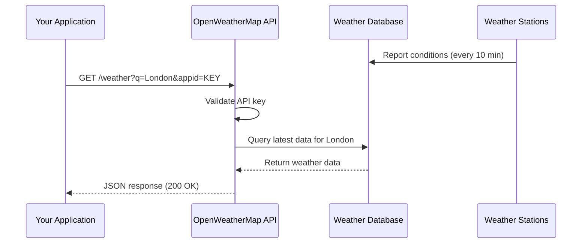
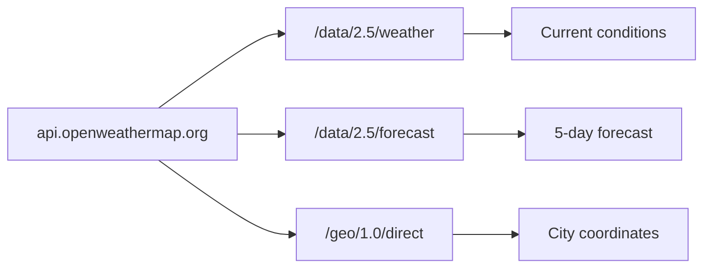

# API Architecture Overview

This page explains how the OpenWeatherMap API is structured and how data
flows from weather stations to your application.

## Request Flow

## API Structure

The OpenWeatherMap API follows REST conventions:

## Data Freshness

Weather data is collected from a global network of stations and updated
approximately every 10 minutes. When you make an API request, you receive
the most recent data available for that location.

| Data Type        | Update Frequency  | Source                    |
|------------------|-------------------|---------------------------|
| Current weather  | Every 10 minutes  | Weather stations globally |
| 5-day forecast   | Every 3 hours     | Weather prediction models |
| Geocoding        | Static            | Location database         |

## Units System

The API supports three unit systems, controlled by the `units` parameter:

| Parameter Value | Temperature | Wind Speed | Description   |
|-----------------|-------------|------------|---------------|
| `standard`      | Kelvin (K)  | m/s        | Default       |
| `metric`        | Celsius (°C)| m/s        | Most countries|
| `imperial`      | Fahrenheit  | mph        | US            |

:::tip
Always specify `units=metric` or `units=imperial` explicitly. The default
(Kelvin) is rarely what developers want and causes confusion.
:::
