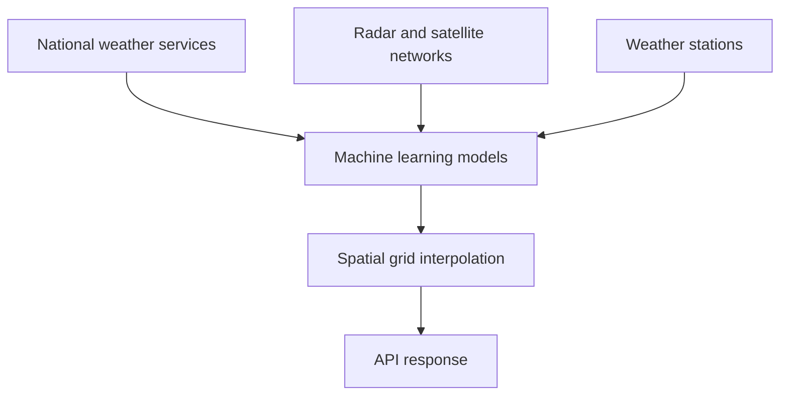

# How weather data works

When you request weather data from the OpenWeatherMap API, you aren't communicating with a single thermometer. You are accessing a massive, aggregated database powered by complex meteorological systems.

## Data sources

OpenWeatherMap aggregates data from tens of thousands of global sources:

1. **Global Meteorological Broadcast Services:** Official data from national weather services (like NOAA in the US, or the Met Office in the UK).
2. **Radar and Satellite Networks:** Real-time imagery interpreting cloud cover and precipitation.
3. **Weather Stations:** Over 40,000 professional and privately owned weather stations globally.
4. **Machine Learning Models:** OpenWeatherMap uses proprietary AI to resolve inconsistencies between different sources and smooth out geographic gaps.

## The grid system

Because physical weather stations aren't located on every square meter of the Earth, the API calculates data using a spatial grid. 

When you request the weather for a specific latitude and longitude, the API looks at the grid cell containing that point and interpolates the data based on the nearest surrounding data sources and current modeling parameters. 

This is why two slightly different coordinates within the same city might return the exact same weather data.

## Freshness and caching

Weather changes constantly, but computational modeling takes time. 

- **Current Weather** is updated across the system roughly every 10–15 minutes. 
- **Forecast Models** are computed in massive batch processes and updated every 3 hours.

Because of this, sending an API request every 5 seconds will simply return the exact same data while burning through your rate limits. It is an industry standard to cache weather data for at least 10 minutes on your own servers.
