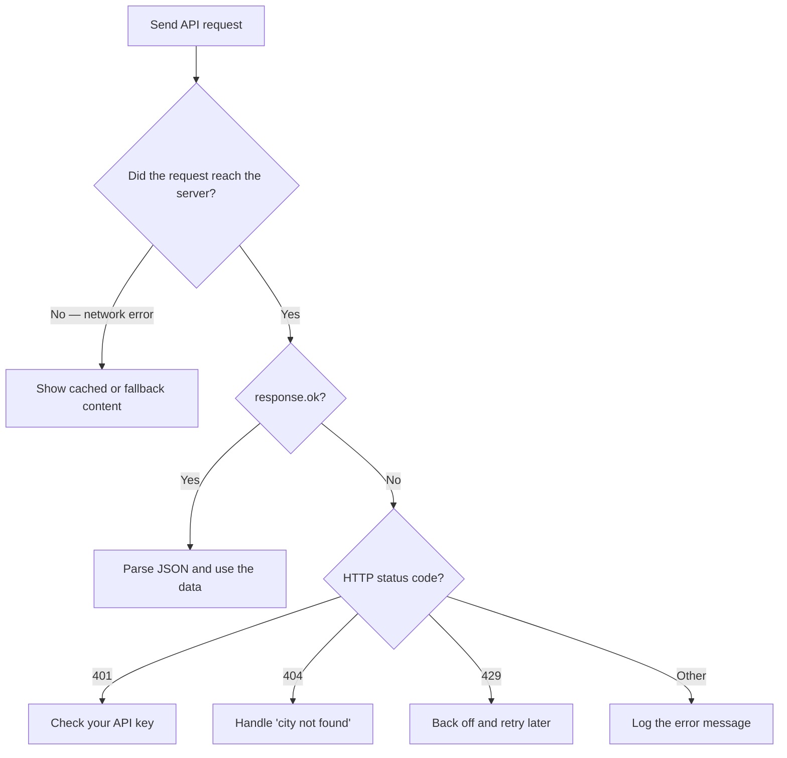

# Handle errors gracefully

Robust applications don't crash when APIs fail. The OpenWeatherMap API uses standard HTTP status codes, but also returns a JSON payload detailing the error.

## The error format

When a request fails, the API returns a JSON object containing a `cod` (status code) and a `message`.

```json
{
  "cod": "404",
  "message": "city not found"
}
```

:::warning Inconsistent Types
Note that sometimes `cod` is returned as a String (e.g., `"404"`) and sometimes as an Integer (e.g., `401`). When writing logic to check this field, cast it to an Integer or rely on the HTTP Response headers instead.
:::

## Strategy: rely on HTTP status codes

The most reliable way to handle errors is checking the HTTP status code of the response before trying to parse the JSON.



### Node.js (fetch) example

```javascript
async function safeGetWeather(city) {
  try {
    const response = await fetch(
      `https://api.openweathermap.org/data/2.5/weather?q=${city}&appid=${API_KEY}`
    );

    // If the HTTP status is 4xx or 5xx
    if (!response.ok) {
      const errorData = await response.json();
      
      switch (response.status) {
        case 401:
          console.error("Auth Error: Check your API key.");
          break;
        case 404:
          console.error(`User Error: City '${city}' could not be found.`);
          break;
        case 429:
          console.error("Rate Limit: We are sending too many requests.");
          break;
        default:
          console.error(`API Error: ${errorData.message}`);
      }
      return null;
    }

    return await response.json();

  } catch (networkError) {
    // This catches network drops, DNS failures, etc. (Not API HTTP errors)
    console.error("Network Error: Could not reach OpenWeatherMap servers.");
    return null;
  }
}
```

## Strategy: fallback content

If the API is down or the user is offline, you don't want your app to show a blank screen.

1. **Cache previous results:** If you successfully fetched the weather an hour ago, save it in `localStorage` or a database. If the next request fails, show the cached data with a warning: *"Offline: Showing last known conditions."*
2. **Graceful UI states:** If no cache is available, render a friendly error illustration instead of a broken layout.

## Checking the error codes reference

For a complete list of what status codes mean in the context of OpenWeatherMap, visit the [Error Codes Reference](../reference/error-codes).
