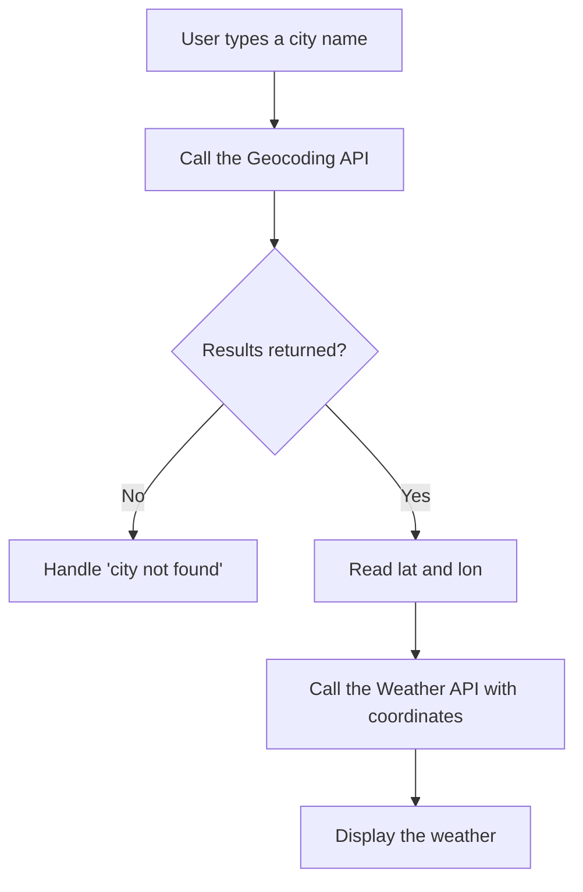

# Use geographic coordinates

Querying by city name is convenient, but querying by latitude and longitude is **accurate**. 
OpenWeatherMap highly recommends using geographic coordinates (`lat` and `lon`) for production applications to avoid ambiguity.

## Making a coordinate request

Instead of the `q` parameter, use `lat` and `lon`:

```bash
curl "https://api.openweathermap.org/data/2.5/weather?lat=35.6895&lon=139.6917&appid=$OPENWEATHER_API_KEY"
```

## Where do coordinates come from?

If your user is providing a city name, how do you get the coordinates? You use a **Geocoding API**.

OpenWeatherMap provides a free Geocoding API specifically for this purpose. The standard workflow is:

1. User types "Paris"
2. Your app calls the Geocoding API with "Paris"
3. Geocoding API returns `lat: 48.8588`, `lon: 2.3200`
4. Your app calls the Weather API with `lat: 48.8588`, `lon: 2.3200`



### Step 1: Geocode the city

```javascript
const cityName = "Paris";
const geoResponse = await fetch(
  `https://api.openweathermap.org/geo/1.0/direct?q=${cityName}&limit=1&appid=${API_KEY}`
);
const geoData = await geoResponse.json();

if (geoData.length === 0) {
  throw new Error("City not found");
}

const { lat, lon } = geoData[0];
console.log(`Found Paris at ${lat}, ${lon}`);
```

### Step 2: Fetch the weather

```javascript
const weatherResponse = await fetch(
  `https://api.openweathermap.org/data/2.5/weather?lat=${lat}&lon=${lon}&units=metric&appid=${API_KEY}`
);
const weatherData = await weatherResponse.json();
```

## Using browser geolocation

If you are building a web application, you can use the HTML5 Geolocation API to get the user's exact coordinates without asking them to type a city name.

```javascript
if ("geolocation" in navigator) {
  navigator.geolocation.getCurrentPosition(async (position) => {
    const lat = position.coords.latitude;
    const lon = position.coords.longitude;
    
    // Now call OpenWeatherMap with lat and lon
    console.log(`User is at ${lat}, ${lon}`);
  });
} else {
  console.log("Geolocation is not supported by this browser.");
}
```

:::caution Privacy
The browser will prompt the user for permission before sharing their location. Always provide a fallback (like a text input for city name) in case the user denies permission.
:::
